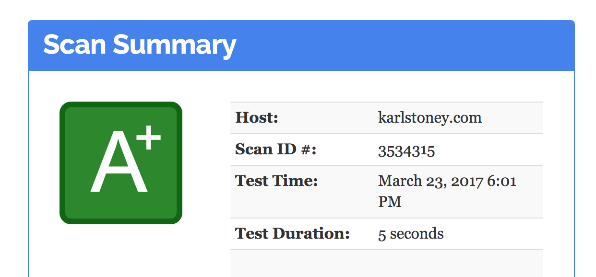

# nginx
The purpose of this repository is to create an easy to use Nginx reverse proxy, which can generate certificates using letsencrypt [letsencrypt](https://letsencrypt.org/), and also give you a nice shiny a+ on [observatory](https://observatory.mozilla.org/).



## Automatic certificate generation
When the container boots, if no certificates are found, it will do the following:

  - First create a self signed certificate for the domain in question (so we can start nginx, and letsencrypt can do it's host checks).
  - Use [simp_le](https://github.com/zenhack/simp_le) to generate, or update the letsencrypt certificates for the domain.

It's important that the letsencrypt servers can contact your selected domain in order to do validation, and this container is running on the server that hosts that doman.  Basically, this is the flow of events:
```
Container Boots
  -> Self Signed certificates generated for given domain(s)
  -> Triggers LetsEncrypt for given domain(s)
  -> LetsEncrypt servers try and talk to yourdomain.net/.well-known/<secret>
  -> LetsEncrypt servers return certificate
  -> Self signed replaced with LetsEncrypt certs
  -> Container restarts NGINX
```

## Multiple domains, no configuration
You can host multiple domains on the same NGINX:443 host (see the example below).

The default server part is important, as we're hosting multiple SSL certificates on the same IP, Nginx will use [SNI](https://en.wikipedia.org/wiki/Server_Name_Indication) to serve up the relevant endpoint.  If the client doesn't support SNI (for example, my curl client on macosx?!) then you'll get the default server.

## Config file
__IMPORTANT__: Breaking change in `1.11.10-5`, we now use a configuration file, rather than loads of environment variables, this allows for more configuration.  You need to make sure you mount `/config/config.js`.

This is an example of a two host configuration, one is `karlstoney.com`, which upstreams to `app:2368`, and then the other `www.karlstoney.com`, which just redirects to `karlstoney.com`.  It's actually the configuration I use on my blog [karlstoney.com](https://karlstoney.com). 

You can add as many hosts as you want.

```
module.exports = {
  karlstoney: {
    fqdn: 'karlstoney.com',
    redirectInsecure: true,
    useHsts: true,
    useCsp: true,
    csp: "default-src 'self' wss: https://fonts.gstatic.com https://fonts.googleapis.com https://code.jquery.com https://s3-eu-west-1.amazonaws.com https://karlstoney.disqus.com 'nonce-$cspNonce'",
    default: true,
    upstreams: {
      root: 'app:2368'
    },
    paths: {
      '/': 'root'
    }
  },
  www: {
    fqdn: 'www.karlstoney.com',
    redirect: 'https://karlstoney.com'
  }
}
```

And then have a docker-compose file like this: 
```
version: '2'

services:
  nginx:
    image: stono/docker-nginx-letsencrypt
    restart: always
    volumes:
      - ./certs:/etc/letsencrypt/live
      - ./config.js:/config/config.js
    environment:
      - LETSENCRYPT_EMAIL=youremail@yourdomain.com
      - LETSENCRYPT=true
    ports:
      - 443
      - 80
```

### Configuration options
There are some mandatory paramters on a site:

  - fqdn: The FQDN of your domain
  - upstreams: The definition of the site upstreams 
  - paths: the paths to send to the upstreams

There are some optional paramters:

  - default: Should this be the default site for none FQDN matches
  - redirectInsecure: Should we send port 80 requests to 443
  - useHsts: Should the https site send a HSTS header
  - useCsp: Will enable the Content-Security-Policy header with the reccomended default policy "default-src 'none'; img-src 'self'; script-src 'self'; style-src 'self'"
  - csp: Override the csp string
  - other_server: Arbitary lines to add to the server block

#### Notes about Content Security Policy
Nginx has been compiled to generate a Content Security Policy nonce, this is expose in the nginx configuration as $cspNonce.  Nginx will look through your upstream and effectively find and replace a `**CSP_NONCE**` string, with the actual nonce.  This will allow you to use inline blocks and styles if you need to, for example:

This would not execute:

```
<script>
  alert('hi');
</script>
```

Whereas this would:
```
<script nonce='**CSP_NONCE**'>
  alert('hi');
</script>

```

## Volumes
You need to persist your certificates, so mount the `/etc/letsencrypt` folder!
